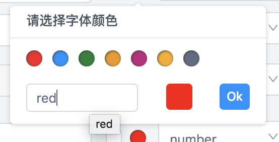

# react-color-plate
A color picker tool for React

#### 参数
| 参数名 | 是否必须 | 描述 |
| - | - | - |
| title | 非必须 | modal的标题，默认为'Please choose your color' |
| defaultColor | 必须 | 默认颜色 |
| callback | 非必须 | 回调函数 |
| colorsList | 非必须 | 初始颜色列表 |

